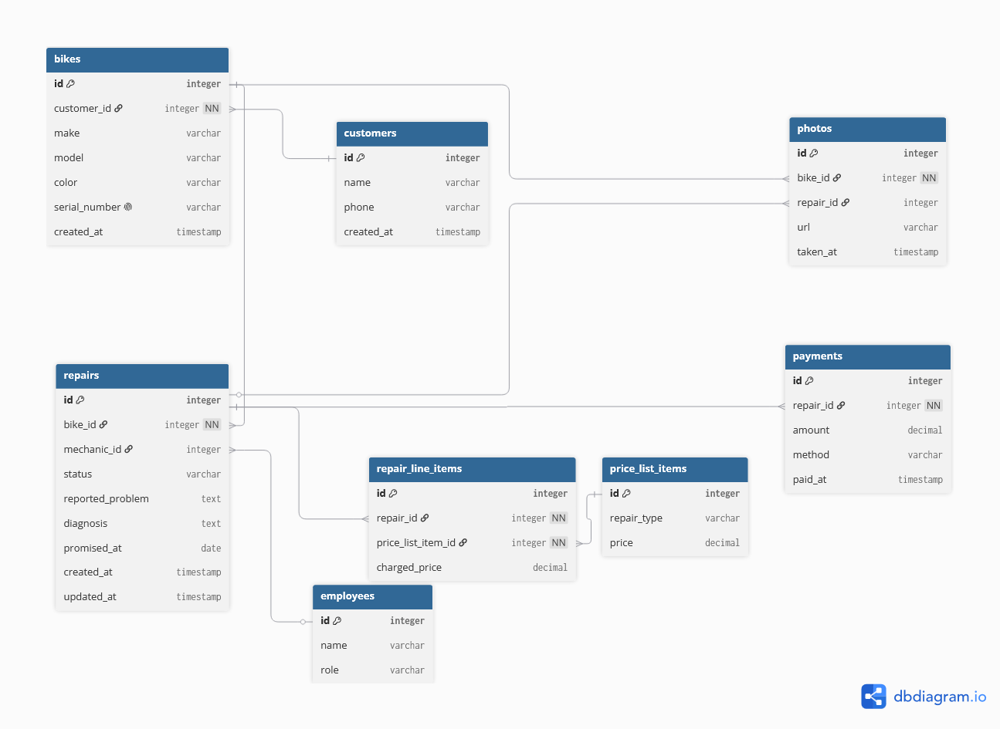

## Diagram

I made this in dbdiagram.io, here's the exported image:



And this is the code that made it:

```dbml
Table customers {
  id integer [primary key]
  name varchar
  phone varchar
  created_at timestamp
}

Table bikes {
  id integer [primary key]
  customer_id integer [not null, ref: > customers.id]
  make varchar
  model varchar
  color varchar
  serial_number varchar [unique, note: 'so two bikes that look the same dont get mixed up']
  created_at timestamp
}

Table employees {
  id integer [primary key]
  name varchar
  role varchar [note: 'mechanic or counter']
}

Table repairs {
  id integer [primary key]
  bike_id integer [not null, ref: > bikes.id]
  mechanic_id integer [ref: >? employees.id, note: 'null until someone is assigned']
  status varchar [note: 'received, diagnosing, quoted, approved, declined, in_repair, ready_for_pickup, completed']
  reported_problem text
  diagnosis text
  promised_at date
  created_at timestamp
  updated_at timestamp
}

Table price_list_items {
  id integer [primary key]
  repair_type varchar
  price decimal
}

Table repair_line_items {
  id integer [primary key]
  repair_id integer [not null, ref: > repairs.id]
  price_list_item_id integer [not null, ref: > price_list_items.id]
  charged_price decimal [note: 'copied from the price list at the time, can be discounted']
}

Table photos {
  id integer [primary key]
  bike_id integer [not null, ref: > bikes.id]
  repair_id integer [ref: >? repairs.id, note: 'some photos are just of the bike, not a specific repair']
  url varchar
  taken_at timestamp
}

Table payments {
  id integer [primary key]
  repair_id integer [not null, ref: > repairs.id]
  amount decimal
  method varchar [note: 'cash, card, transfer']
  paid_at timestamp
}
```

## Lifecycle

A repair moves through these states, in this order (mostly):

received -> diagnosing -> quoted -> approved (or declined) -> in_repair -> ready_for_pickup -> completed

Some transitions shouldn't be allowed and I think it's worth listing why:

- received straight to approved: doesn't make sense, nobody quoted anything yet so there's nothing to approve
- diagnosing to in_repair: same idea, can't start working before the customer said yes to a price
- declined to in_repair: if they said no, that's it for this repair. If they change their mind later I guess it would be a new repair
- completed to anything else: once it's done it's done, shouldn't be able to reopen it

## Which entity comes from which story

| Entity            | Story                                                                                                                     |
| ----------------- | ------------------------------------------------------------------------------------------------------------------------- |
| customers         | Story 2                                                                                                                   |
| bikes             | Story 1, Story 11                                                                                                         |
| employees         | Story 3, Story 7                                                                                                          |
| repairs           | Story 2, 6, 7, 8, 13 (most of them really, this is the main table)                                                        |
| price_list_items  | Story 12                                                                                                                  |
| repair_line_items | Story 4, this is where the cost actually comes from                                                                       |
| photos            | not tied to one specific story number, but the owner talks about taking photos when the bike arrives so I added it anyway |
| payments          | Story 10                                                                                                                  |

## Two decisions I had to explain

**The thing and the copy of the thing.** So the owner mentioned that one time they mixed up two bikes because they were the same model and color (two blue Marlins). If I had just used one row per bike model with a quantity column, there would be no way to tell those two bikes apart, or know which specific one a repair belongs to. That's why every bike has its own row and its own serial_number, and repairs point at one exact bike_id, never just "a blue Marlin."

**Derived, or stored?** For whether a repair is late, I didn't add a column for that at all, it's just calculated by comparing promised_at to today whenever you look at the screen, no need to store it. But for charged_price on the line items, I did store it even though you could argue it's just copying price_list_items.price. I stored it anyway because prices go up every January and old repairs shouldn't suddenly cost more just because the list changed later. If I hadn't stored it, every past invoice would change every time the price list changes, which is wrong.
