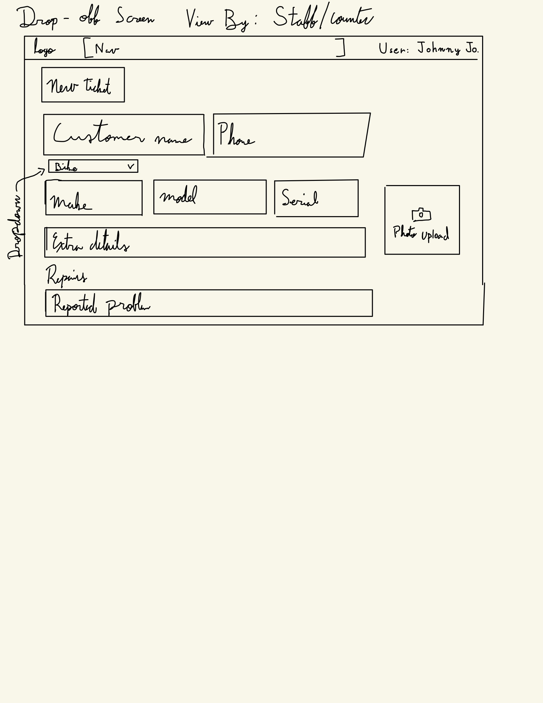
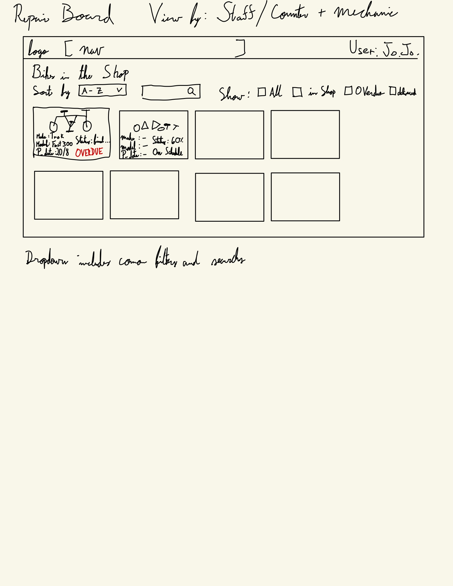
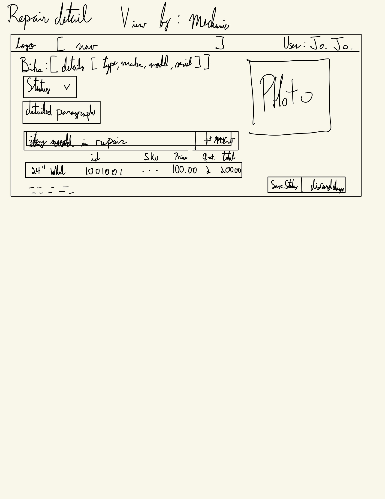
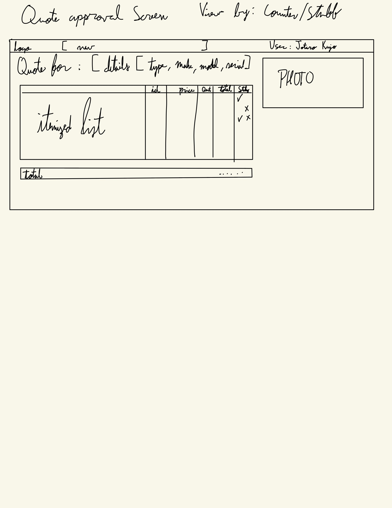

## 1. Drop-off (counter staff)

Where a new repair starts: customer name/phone, bike details, reported problem, photo.

## 2. Repair board (counter staff, mechanic)

List of all bikes currently in the shop with status. This is the "is this bike ready?" screen.

## 3. Repair detail / diagnosis (mechanic)

Where the mechanic writes the diagnosis, adds line items from the price list, sets the promised date.

## 4. Quote approval (counter staff)

Shows line items and total, records the customer's approve/decline.

